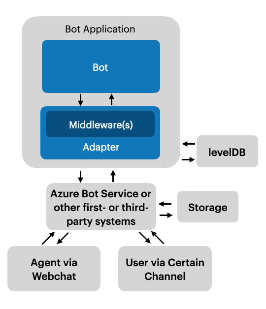
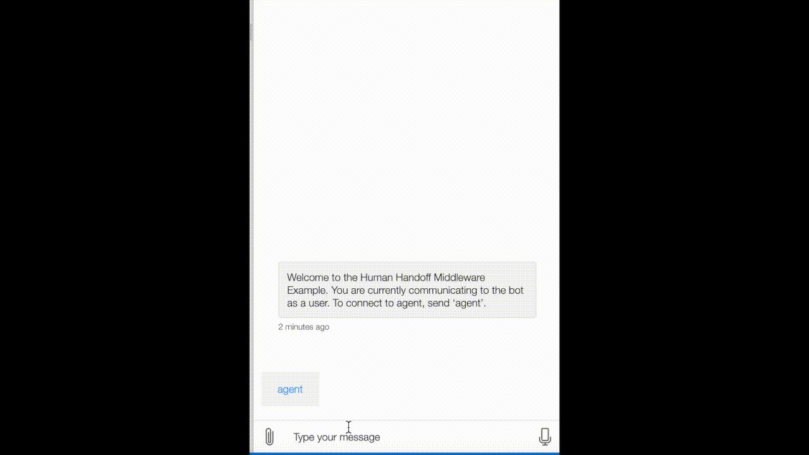
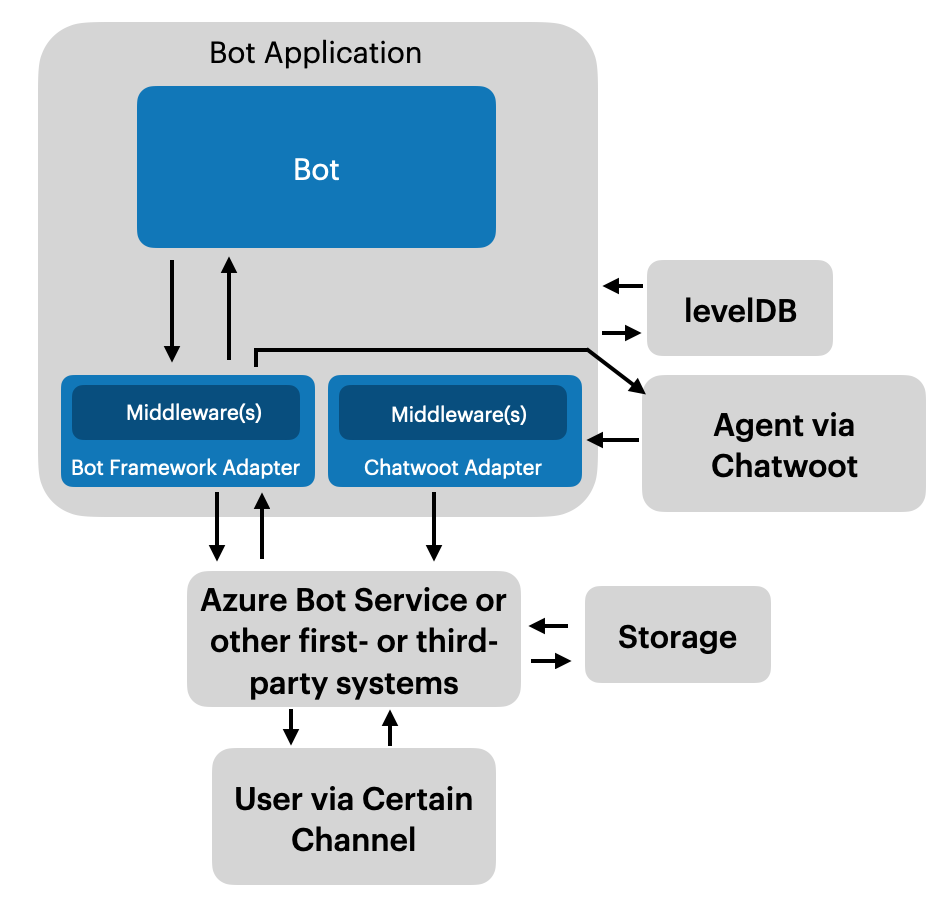

# Microsoft Bot Framework Human Handover

In automated dialogue-based systems, the conversation between chatbots and users would inevitably get stuck at some point and be handed over to an agent for help. 

Based on [the work of TJ Durnford](https://github.com/tdurnford), this repository provides two prototypes (in different branches) to address handover situations for the chatbots via different agent platforms: 

- handover to the Wet Chat channel within Bot Frameowork
- handover to an agent in the open source software Chatwoot

This focus is how the connectivity between agents and users is achieved instead of what triggers the conversation to transfer.  Hence, simple trigger word ‘talk to human’ is used for handover.

# **Prerequisites**

## Node

- version v16.8.0

## Azure

- Get a subscription of Azure:
    - for non-students for the first time: [get a free trial](https://azure.microsoft.com/en-us/free/search/?ef_id=CjwKCAjw5dqgBhBNEiwA7PryaG51bPWx-qb5lWyN_dzniyzl4pzV51WFOaChDg-BkTW-joBxxzaikBoCCZIQAvD_BwE%3AG%3As&OCID=AIDcmmzzaokddl_SEM_CjwKCAjw5dqgBhBNEiwA7PryaG51bPWx-qb5lWyN_dzniyzl4pzV51WFOaChDg-BkTW-joBxxzaikBoCCZIQAvD_BwE%3AG%3As&gclid=CjwKCAjw5dqgBhBNEiwA7PryaG51bPWx-qb5lWyN_dzniyzl4pzV51WFOaChDg-BkTW-joBxxzaikBoCCZIQAvD_BwE)
    - for students: [get a free trial](https://azure.microsoft.com/en-us/free/students/)
- Download Azure command line (CLI): follow the tutorial [here](https://learn.microsoft.com/en-us/cli/azure/install-azure-cli)

## Microsoft Bot Framework

- Get an [overview](https://learn.microsoft.com/en-us/azure/bot-service/bot-builder-basics?view=azure-bot-service-4.0) of how bots work within Bot Framework: **Bot Application Structure** (concepts of bot application, adapter, **middleware**, bot class); the activity processing stack, etc
- Download [Bot Framework Emulator](https://github.com/Microsoft/BotFramework-Emulator/releases/tag/v4.14.1): helps to test the bot application

## Others

- Download [ngrok](https://ngrok.com/download):  enables secure tunneling to expose local network ports to the internet across different platforms.
- If you want to use chatwoot, follow the [self-hosted installation guide](https://www.chatwoot.com/docs/self-hosted/)

# Handover within Bot Framework

- Checkout Branch `master`

## Handover Flow



## Run the Bot

- Create a bot in Azure Bot Services: tutorial [here](https://learn.microsoft.com/en-us/azure/bot-service/abs-quickstart?view=azure-bot-service-4.0&tabs=multitenant) (for simplicity select multi-tenant for Bot identity)
- Obtain Microsoft *App ID* and *App Password*:  after a bot is created,  see in *configuration*
- Configure file handoff.bot: configure  *appId* and *appPassword*
    ```python
        "appId": "<--YOUR APP ID-->",
        "appPassword": "<--YOU APP PASSWORD-->",
    ```
- Configure file .env: configure  *MicrosoftAppId* and *MicrosoftAppPassword*
    ```python
        MicrosoftAppId=<--YOUR APP ID-->
        MicrosoftAppPassword=<--YOU APP PASSWORD-->
    ```
- Start an ngrok connection for the bot running locally: `ngrok http 3978`
- Configure messaging endpoint:
    - go to *configuration* for the bot in Azure
    - change *messaging endpoing* to: *<address-by-ngrok>/api/messages* (for example , it might look like [https://some-address.eu.ngrok.io/api/messages](https://86c2-138-246-3-7.eu.ngrok.io/api/messages))
- Install modules:  `npm install`
- Start running the bot: `npm start`
- Talk to the bot: open the Bot Emulator and connect via *open a .bot file* (select file *handoff.bot*), the trigger phrase for handover is *talk to human*

## Run the Agent via Web Chat

- Go to the web application directory: `cd public/react-webchat`
- Install modules:  `npm install`
- Obtain Web Chat secrect:  follow the [tutorial](https://learn.microsoft.com/en-us/azure/bot-service/bot-service-channel-connect-webchat?view=azure-bot-service-4.0) under the section ‘Get your bot secret key’
- Add Web Chat secrect:
    - `cd public/react-webchat/src/WebChat.js`
    - find the following code snippet and add the secret after `Bearer`
        
        ```python
        headers: {
                    'Authorization': `Bearer <---WEB CHAT SECRET KEYS->`,
                    'Content-Type': 'application/json'
                  }
        ```
        
- Start running Web Chat: `npm start`

## Demo



# Handover via Chatwoot

- Checkout Branch `cw-dev`

## Handover Flow



## Run the Bot

- The same as within Bot Framework
- Create a bot in Azure Bot Services: tutorial [here](https://learn.microsoft.com/en-us/azure/bot-service/abs-quickstart?view=azure-bot-service-4.0&tabs=multitenant) (for simplicity select multi-tenant for Bot identity)
- Obtain Microsoft *App ID* and *App Password*:  after a bot is created,  see in *configuration*
- Configure file handoff.bot: configure  *appId* and *appPassword*
    ```python
        "appId": "<--YOUR APP ID-->",
        "appPassword": "<--YOU APP PASSWORD-->",
    ```
- Configure file .env: configure  *MicrosoftAppId* and *MicrosoftAppPassword*
    ```python
        MicrosoftAppId=<--YOUR APP ID-->
        MicrosoftAppPassword=<--YOU APP PASSWORD-->
    ```
- Install modules:  `npm install`
- Start running the bot: `npm start`
- Talk to the bot: open the Bot Emulator and connect via *open a .bot file* (select file *handoff.bot*), the trigger phrase for handover is *talk to human*

## Run the Chatwoot

- Start an ngrok connection for the bot running locally: `ngrok http 3978`
- Start Chatwoot locally: depending on the platform, follow the [tutorial](https://www.chatwoot.com/docs/self-hosted/)
- Configure *chatwootHost, chatwootPort, chatwootURL* in the enviroment file `.env`.
    
    ```python
    chatwootHost=<--YOUR CHATWOOTHOST-->
    chatwootPort=<--YOUR CHATWOOTPORT-->
    chatwootURL=<--YOUR CHATWOOTURL-->

    ## For example
    # chatwootHost=localhost
    # chatwootPort=3000
    # chatwootURL=localhost:3000
    ```
    
- Configure Webhook URL in Chatwoot
    - In Chatwoot, create an API inbox with the [tutorial](https://www.chatwoot.com/docs/product/channels/api/create-channel/)
    - While creating the API inbox, set the *Webhook URL to the* address by ngrok
- Configure the inboxId in in the enviroment file `.env`
    ```python
    inboxId=<--YOUR CHATWOOT INBOXID-->
    ```
    

## Demo


# Deploy the Bot on Azure

- Follow the tutorial [here](https://learn.microsoft.com/en-us/azure/bot-service/provision-and-publish-a-bot?view=azure-bot-service-4.0&tabs=userassigned%2Ccsharp)